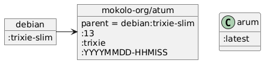

# Docker image mokolo-org/atum:trixie

Base Docker image based on debian:trixie:

- Latest updates after building
- With locales
- Timezone Europe/Amsterdam
- A script that converts a version string into valid tags
  (major version '6', minor version '6.12' and full version '6.12.3-debug')

## Name

Atum is the Egyptian creator god, the first god in the Heliopolitan ennead.
In Wikipedia there's a lemma for [Atum](https://en.wikipedia.org/wiki/Atum)

## Inheritance



## Build image

Use command `make build` to build the image.\

## Build images in doc/

- Download a recent MIT licensed version of PlantUML as a .jar file
  and store it in a directory.
  I used `~/share/java/plantuml-mit-1.2024.7.jar` for this
- Make sure you have a Java JRE installed;
  in Debian install the 'default-jre-headless' package
  if you have not yet installed a JRE.
- Make sure GraphViz is installed;
  Debian package 'graphviz'.
- Create a bash script `~/.local/bin/plantuml` as shown below

```bash
#! /bin/bash

java -jar ~/share/java/plantuml-mit-1.2024.7.jar $*
```

- Make the script executable
- In the doc-directory use `make images` to generate new images after a change
